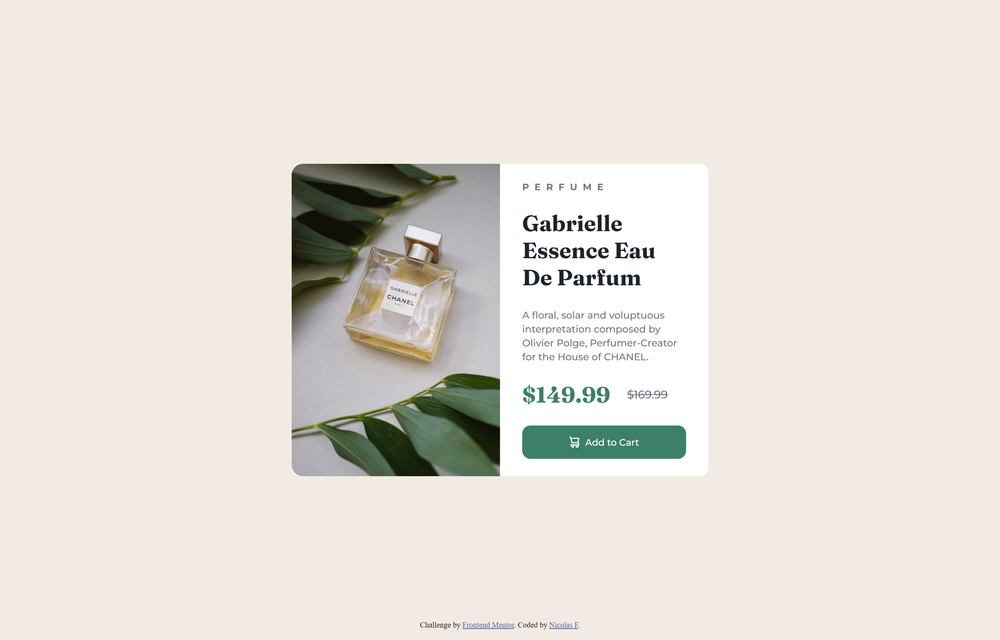

# Frontend Mentor - Four card feature section solution

This is a solution to the [Four card feature section challenge on Frontend Mentor](https://www.frontendmentor.io/challenges/four-card-feature-section-weK1eFYK). Frontend Mentor challenges help you improve your coding skills by building realistic projects.

## Table of contents

- [Overview](#overview)
  - [The challenge](#the-challenge)
  - [Screenshot](#screenshot)
  - [Links](#links)
- [My process](#my-process)
  - [Built with](#built-with)
  - [What I learned](#what-i-learned)
  - [Continued development](#continued-development)
  - [Useful resources](#useful-resources)
- [Author](#author)
- [Acknowledgments](#acknowledgments)

**Note: Delete this note and update the table of contents based on what sections you keep.**

## Overview

### The challenge

Users should be able to:

- View the optimal layout for the site depending on their device's screen size

### ScreenshotS

#### Desktop



#### Mobile


### Links

- Solution URL: [Code](https://github.com/nicolasfig/product-preview-card-component)
- Live Site URL: [Live site](https://nicolasfig.github.io/product-preview-card-component/)

## My process

### Built with

- Semantic HTML5 markup
- CSS custom properties
- Flexbox
- CSS Grid

### What I learned

I learned some flexbox, basically building upon previous projects, I had some trouble adjusting the image width to fit correctly inside the container div

```css
.card .image {
  background: url(./images/image-product-mobile.jpg);
  background-size: cover;
  background-repeat: no-repeat;
  border-radius: 0.75rem 0.75rem 0 0;
  width: 100%;
  height: 240px;
}
```

### Useful resources

- [Flexbox Malven](https://flexbox.malven.co/) - Useful flexbox reference as always
- [MDN](https://developer.mozilla.org/en-US/) - MDN the best documentation

## Author

- Frontend Mentor - [@nicolasfig](https://www.frontendmentor.io/profile/nicolasfig)
